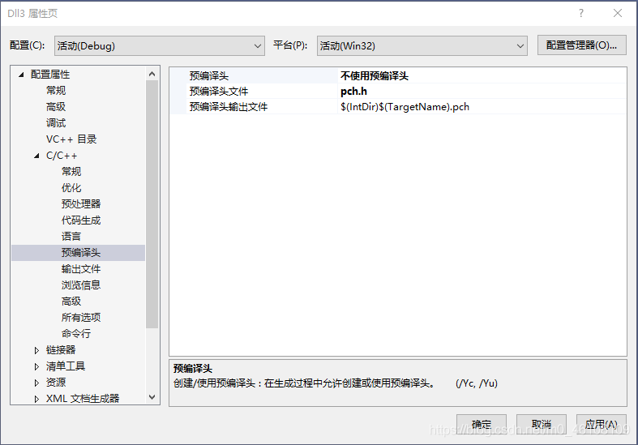

@[TOC](第0章 Hello Markdown)
#  0.0 Hello World

最初学习编程的时候，一直纳闷别人的EXE文件是怎么制作出来的，为什么我写不出真正的程序。后来学了C以后，才知道了编译器、连接器的概念，但是被糟糕的教程和匪夷所思的指针劝退了。编程语言大概学了十来种，全部都是只能写出**Hello World**的水平，从来没有编出过专业的程序。😂

## 0.1 新的改变

现在，我准备开始编写专业代码，从头开始学习编程，在这里写下开发日记。想通过开发日志这样的方式，强化效果，提高效率。  
开发计划：
 1. 学习**Visual Studio**，学会使用IDE ；（用vc6的时候，真是头大）(再次编辑这篇文章的时候，又过去了三年，好在终于跑得起来IDE了)
 2. 学习**c primer plus**，全面掌握C ；（现在看到c++ primer plus了）（c++ primer，还没有看，不过大概算是入门了）
 3. 学习**Windows 程序设计**，掌握项目有关部分；（这个估计得明年了）（这个不看了，改看MFC了）
 4. 学习 **Windows 核心编程** ，编写专业输入法；（不知道会不会看到这里）（这个没有必要看了，我还没有学会的东西，早已更新了）
 5. ************************终于想出了算法，其实在CSDN早就有人指点过我，当时不知所以然。做了太多无用功，幸运的是终于研究出了。
 6. 找到**开发资料[^1]** ，整理搜集别人写的一些文献；（学习github的时候，顺便整理一下相关资料）（开发资料看不懂，备注里没有）
 7. 找到 **可参考的源码** ，学习前人所写代码；（找到了几个源码，不知道当年为什么没找到）
 8. 开始 **输入法编程** ，面向Windows 10。（第一次写这个贴子的时候win10还没有出，打算开始编码的时候10已经要停止更新了）
 [^1]: [开发资料](https://www.csdn.net/)

## 0.2 功能快捷键

这篇文档的格式是源自MarkDown的一篇教学示例，我一边学习MarkDown一边整理资料的。
文档中链接的资料，我尽量找到了最早的出处，大多数应该就是后面标注的作者所写。
（下面的资料已经没用了，这时当时学习ime输入法开发时的资料）

IME输入法编程溯源：<kbd>https://www.cnblogs.com/freedomshe/archive/2012/11/13/ime-resources.html</kbd> + <kbd>FreedomShe</kbd>  
Win32 Multilingual IME Overview for IME Development：<kbd>https://blog.csdn.net/fakine/article/details/52355215</kbd> + <kbd>fakine</kbd>  
Win32 Multilingual IME Application Programming Interface：<kbd>http://blog.sina.com.cn/s/blog_dcbaca180102wve9.html</kbd> + <kbd>波若冰凌</kbd>  
Win下的输入法（IME）编程（1）：<kbd>https://blog.csdn.net/pkfish/article/details/7339890</kbd> + <kbd>pkfish</kbd>  
Win下的输入法（IME）编程（2）：<kbd>https://blog.csdn.net/pkfish/article/details/7339909</kbd> + <kbd>pkfish</kbd> + <kbd>H</kbd>  
《浅谈输入法编程》：<kbd>https://blog.csdn.net/chengg0769/article/details/5796151</kbd> + <kbd>启程</kbd> + <kbd>这次准备用启程输入法的源码</kbd>  
Win32 IME 编程心得：<kbd>https://blog.csdn.net/tangsilai/article/details/8313004</kbd> + <kbd>影舞笔</kbd>  
输入法编程指南：<kbd>https://blog.csdn.net/Augusdi/article/details/4599000</kbd> + <kbd>Shift</kbd> + <kbd>K</kbd>  
IME输入法编程四章：<kbd>https://blog.csdn.net/itclock/article/details/475038</kbd> + <kbd>王卫</kbd> + <kbd>O</kbd>  
IMM输入法概述：<kbd>https://blog.csdn.net/new_smile/article/details/51097366</kbd> + <kbd>fakine</kbd>  
Windows 95 输入法编辑器：<kbd>http://input.foruto.com/sbxlm/Technique/IME95.htm</kbd> + <kbd>戴石麟</kbd> + <kbd>译自微软的MSDN DDK</kbd>  
windows2000 DDK中IME输入法编程的资料(前10页)：<kbd>http://blog.sina.com.cn/s/blog_5729b5010100q5xn.html</kbd> + <kbd>糊涂茶</kbd>  
IME输入法编程心得：<kbd>https://www.cnblogs.com/freedomshe/archive/2012/11/30/ime_learning.html</kbd> + <kbd>FreedomShe</kbd>  

## 0.3 合理的创建标题，有助于目录的生成
（这是ime的安装方法，我会重新编写一篇关于tsf输入法的安装方法）
**没有全面的输入法编程文档！** 本文的内容大多是前人自己摸索出来的。在后面小节我会加上vs2019的输入法工程配置。  
输入法编程之工程配置：<kbd>https://blog.csdn.net/whyhit2005/article/details/5479817</kbd>  
使用（IME）模式VS2010 编写 和 安装 输入法 教程：<kbd>https://blog.csdn.net/fakine/article/details/52488152</kbd>  
事实上前面的资源中还有一些输入法安装卸载调试教程，之所以在这里列出这两个教程，是因为目前我还在整理资料阶段。我准备先从win2000 ddk中的`区位输入法`开始编写一个标准IME输入法，为编写专业输入做好准备。
## 0.4 如何改变文本的样式
*输入法ddk* https://download.csdn.net/download/chensunhui/3878900
微软的官方示例源码在Windows ddk中，至于最新wdm中有没有，我不清楚，在我编程的时候只有一个版本的ddk中包含里示例源码。为什么输入法在驱动程序开发包中，我是这么理解的，除了中文，世界上还有其他语言。其他语言的文字大多数是字母文字，很容易和键盘按键形成一一对应的关系。这样的文字只需要为这样的键盘编写驱动程序就可以了。中文输入法在历史上也出现过大键盘，这样的输入法应该不符合ime编程接口。另一方面，很多国家的文字字母数量，都在26个字母左右，并不需要另外开发专门的键盘，只需要转义一下按键的符号，就可以完成输入，所以中文输入法和字母文字的输入方法，都归纳到了键盘布局下。

**vs2019安装和使用教程** __https://blog.csdn.net/qq_36556893/article/details/88603729__

下面是开发可能要用到的工具。

~~http://www.winwin7.com/JC/13689.html~~ 

> https://www.vmware.com/cn.html

## 0.5 插入链接与图片

win2000 ddk中的示例源码编译时需要imm32.lib和htmlhelp.lib: [网上搜一下](https://download.csdn.net/)。在vs2019中我使用的是sdk中的imm.h。
新建一个win32的dll工程，把系统自动生成的.h和.cpp文件全部删除。因为使用系统自动生成头文件，改起来麻烦一些。将示例源码中的文件全部拷贝到工程文件夹，有几个文件实际上不需要，这里全部复制过来。
添加现有项，将头文件，源文件和资源文件添加进项目。编译一下。
错误 C1010 在查找预编译头时遇到意外的文件结尾。是否忘记了向源中添加“#include "pch.h"”? 
这个错误与输入法源码无关，只是使用预编译头改起工程来麻烦一些。



再编译一下
错误 C1083 无法打开包括文件: “imedefs.h”: No such file or directory
这个头文件好像是ddk更新的内容，所以没有包含在sdk目录里，而且复制到系统目录可能会有问题。
最好添加到当前目录。 


//这个博客插入图片的示例和csdn的上传图片功能似乎有点不一致，我就不继续演示如何插入带格式的图片了。


将SDL检查关掉，这个问题与输入法工程无关，是IDE的安全检查。
在imedefs.h文件里加上
#define COMBO_IME
这个问题与输入法源码有关，当初我不会创建输入法工程时，这个问题困扰了我很久，后来我推断这是源码版本混乱的问题。
再编译一下。
错误 LNK2019 无法解析的外部符号 _ImmUnlockIMCC@4，该符号在函数 _CreateUIWindow@4 中被引用 

 

在附加依赖项中加入imm32.lib和htmlhelp.lib。再编译一下。
此时应该已经可以完成编译了，对于较低版本的vs，需要手动添加imm32.lib和htmlhelp.lib。
但是工作还没完成，rc资源文件还不正确，这是困扰我很久的另外一个问题。后来了解到还是因为sdk和ddk的版本管理问题，引用依赖对于我来讲挺复杂的。
总之，用记事本打开rc文件，改成下图就可以了，别问为什么。 


还有最后一个问题，添加导出函数文件。


至此一个完整的区位输入法编译完成。我曾经为了创建这个输入法工程，花了好几个月的时间。不排除是我水平的问题，但是，我要说当时是我反复试错才勉强编译成功的。下图是我当时遇到的困境。


## 0.6 如何插入一段漂亮的代码片

在[imm.h](https://docs.microsoft.com/en-us/windows/win32/api/imm/nf-imm-imminstallimea)头文件中，声明了`ImmInstallIME`API函数，我们可以使用该函数安装一个输入法到Windows中。
```
#include <Windows.h>
#include <stdio.h>
#pragma comment(lib,"imm32.lib")
int main(int argc, char* argv[])
{
	HKL IME = ImmInstallIME(L"shurufa.ime", L"输入法");
	if (IME == 0)
	{
		printf("安装失败\n");
	}
	else
	{
		printf("安装成功！\n");
	}
	printf("按任意键退出!\n");
	getchar();
	return 0;
}
```
注意：生成的32位ime要拷贝到SysWOW64目录中，64位的ime要拷贝到System32。
注意：要包括完整的路径名，或者ime文件与安装.exe在同一目录。
这里之所以简化了，是因为还有UAC权限问题，安装失败提升下权限。
运气好的话，就可以成功安装一个输入法了。

本文是写给我自己的，在西游记中有一个猪八戒吃人参果的情节，猪八戒一下子就吃完了，没有很好的体会到滋味。我构思过这样一个科幻剧情，那就是世界毁灭了，只剩下我一个人待在避难所里，为了度过乏味的生活，避难所里有一个人生体验机，插入不同磁碟，就可以体验不同人生。
有个鸡汤说，风景在路上，人生的意义在于过程，结果不重要。可是如果是痛苦的过程呢，一路上都是垃圾呢。曾经对于我来讲，结果真的很重要。

我最初的计划是20岁之前成功，后来修改为30岁之前成功，再后来修改为40岁之前。直到40岁了，成功还遥遥无期，被生活磨去了棱角，才看到了希望的曙光。
运气真的很重要，甚至是最重要的因素。但是这种运气不是中彩票的那种运气，而是可以改变的运气。
最初的10年我凭借的是天赋，我之所以搞输入法是因为我没有电脑。我在六年级就自学了basic，那个时候我只看见电脑10秒钟，程序都是在脑里运行的。在初中阶段才有机会上机练习，上机的时间不足以让我敲进全部程序，我是在纸上写代码在纸上运行的。初三的时候，选择了搞汉字编码，因为这个不需要电脑就可以搞，没想到一搞就是30年。

第二个10年我依靠的是努力，由于学业不好，没有进入专业领域，这恶化了我的开发环境。我曾经自诩看过书店里所有的计算机书籍。当我完成了编码方案再去书店学习编程时，发现有太多的知识不但不懂，而且很难学会了。
现在我发现一切都开始清晰起来。成功不是等于天赋+努力+运气。而是成功=天赋 * 努力 * 运气
问题好比一个保险箱的密码锁是一圈一圈的乘法关系，其他的环节不对，在单独一个环节的努力都是徒劳的，必须同时转对所有环节。
知识好比一个10000块的拼图，开局的时候是一团糟，当你建立起几块重要的知识点后，拼图就会清晰起来，剩下的只需要填补所缺的空白就可以了。
我之前的生活就是这种混乱状态，终于搞来个源码，但是我连建立工程都不会，大概只是成功编译就花去了我几个月的时间，甚至是几年的时间。这个我记不清了，曾经有一段时间，我发现时间丢失了，我丢失了10年的时间，我不知道这些时间我都干什么了。
我设计过几十种编码方案，实际编码大概有十几种，自认为完成的方案有几种，但是都被我自我否定了。连绵不绝的失败影响着我。编码方案不完美，输入法编程不会，智能设计没方向。这是一个乘法问题，三者我都无法解决。
2000年跨年的时候我完成了编码方案，2020年跨年的时候，我在一个庆祝点上班，看着人群我突然顿悟了。那里曾经是我做小生意的地方，我在那里卖过气球卖过鱼竿摆过残棋。为了生活为了理想，我实实在在的拼搏过，努力过。

也许我就是避难所里，躺在人生体验机里的那个人，如同影视文学作品里都是屌丝逆袭的桥段一样，我放入的磁碟就是地狱难度。也许通关真的并不重要，通关后我会在避难所里醒来，再插入另外一片磁碟。
于是我终于等来了运气，那就是一开始我就选对了方向，一开始我就是在做输入法，而不是汉字编码。运气是实力的表现！在这个领域有很多比我编程更厉害的，学问比我更厉害的。但是他们没转对密码锁。而我同时转对了。

上面的内容，也许对于某些人来讲，非常简单，轻轻松松就能编译安装一个输入法。市面上也有很多开发的输入法，似乎这并不是一个问题。但是一个输入法至少包含三个方面，编码方案，编程，智能算法。一个人要同时精通这三个方面则是困难的。我就是在这三个方面同时卡住了，而我没有选择先攻克其中一点。这也是我的运气之一。或者说，我哪个方面都不强，恰好促成了最终方案的形成。

因为形码发明人把输入法当成了汉字编码。

程序员把输入法当成了程序。

拼音输入法把输入法当成了智能算法。

而输入法是输入法！！！

## 0.7 生成一个适合你的列表
安装后，会在注册表添加如下内容。0804似乎键盘布局，E020第三方输入法以此数值开头。Ime File就是ime文件名，Layout File是一个固定的文件名，应该是键盘布局驱动，Layout Text是输入法的名称。
- \HKEY_LOCAL_MACHINE\SYSTEM\CurrentControlSet\Control\Keyboard Layouts
  - \E0200804
    - Ime File
    - Layout File
    - Layout Text

成功安装一个IME输入法，还会修改以下注册表键值。此处是输入法的列表顺序，也就是Ctrl+Shift输入法以此轮换的顺序。

1. HKEY_USERS\Keyboard Layout\Preload
与键盘输入有关的快捷键在此处设置。例如切换输入法为默认输入法。
2. HKEY_USERS\Control Panel\Input Method\Hot Keys
此处是输入法状态条和输入窗口设置的地方，大多数输入法弃用。
3. HKEY_USERS\Control Panel\Input Method
与输入法转换有两个概念，一个是输入法指示器，一个是语言栏。
- [ ] 输入法指示器
输入法指示器就是xp右下角的那个EN图标，win10中的中英图标。设计的目的是为了显示当前输入状态是英文，还是中文。然而目前的输入法已经用回车键实现了临时输入英文，所以看起来这个图标有点鸡肋。
- [x] 语言栏
语言栏就是输入法指示器旁边的输入法图标。语言栏可以停靠在桌面上，这个设计又和输入法状态条功能重叠。TSF接口的输入法可以在语言栏中实现状态条，在win10中IME的输入法会和语言栏与指示器冲突。
在win8的那个磁贴桌面中完全不支持IME输入法，在win10中才恢复了对IME输入法的支持。但是，由于是两套输入系统，存在冲突的地方，好乱啊。
