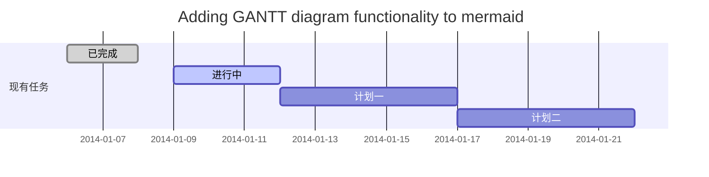
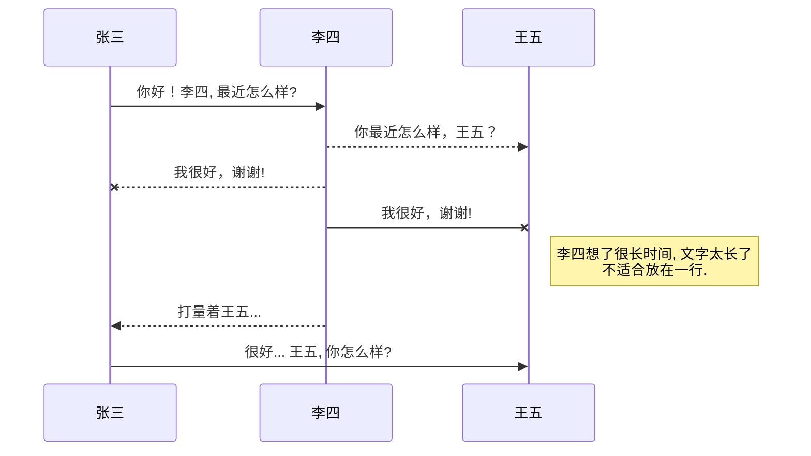
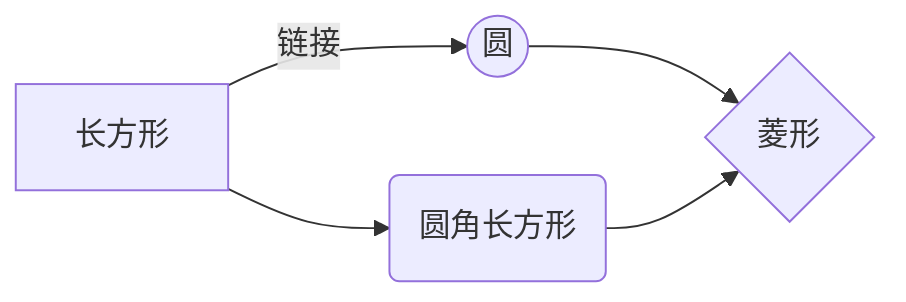

@[TOC](第1章 TSF简介)
# 1.0 本章资料
[Microsoft Windows Text Services Framework](https://learn.microsoft.com/zh-cn/windows/win32/tsf/text-services-framework?redirectedfrom=MSDN)
官方文档，比较难懂。

[逗比的输入法实现](https://yangyuan.github.io/post/2015-01-08-zh-meow-ime/)
这是我找到的最好的TSF输入法介绍。

[TSF输入法中文文档的主页](http://wowoboke.com/tsf/)
可以看看这个作为补充。

[输入法](https://blog.csdn.net/fishmai/category_6752029.html)
比较乱，但是内容非常有价值。

## 1.1创建一个表格

项目     | Describe
-------- | -----
DLL  | TSF和IME输入法一样，都是DLL。IME是通过导出函数实现的输入法功能，而TSF输入法的功能是在COM接口中完成的。
COM  | TSF是一个COM组件。不但要实现相应的TSF框架接口，而且一些输入法功能，也是Windows通过相应接口提供的。
Text Service  | 客户程序和文本服务通过TSF管理器实现管理。

### 1.2设定内容居中、居左、居右
在编译好的TSF输入法目录，以管理员身份启动CMD控制台。
```
regsvr32.exe XXX.dll
```

| 第一列       | 第二列         | 第三列        |
|:-----------:| -------------:|:-------------|
| 第一列文本居中 | 第二列文本居右  | 第三列文本居左 | 

### SmartyPants
SmartyPants将ASCII标点字符转换为“智能”印刷标点HTML实体。例如：
|    TYPE   |ASCII                          |HTML                         
|----------------|-------------------------------|-----------------------------|
|Single backticks|`'Isn't this fun?'`            |'Isn't this fun?'            |
|Quotes          |`"Isn't this fun?"`            |"Isn't this fun?"            |
|Dashes          |`-- is en-dash, --- is em-dash`|-- is en-dash, --- is em-dash|

## 创建一个自定义列表
Markdown
:  Text-to-HTML conversion tool

Authors
:  John
:  Luke

## 如何创建一个注脚

一个具有注脚的文本。[^2]

[^2]: 注脚的解释

##  注释也是必不可少的

Markdown将文本转换为 HTML。

*[HTML]:   超文本标记语言

## KaTeX数学公式

您可以使用渲染LaTeX数学表达式 [KaTeX](https://khan.github.io/KaTeX/):

Gamma公式展示 $\Gamma(n) = (n-1)!\quad\forall
n\in\mathbb N$ 是通过欧拉积分

$$
\Gamma(z) = \int_0^\infty t^{z-1}e^{-t}dt\,.
$$

> 你可以找到更多关于的信息 **LaTeX** 数学表达式[here][1].

## 新的甘特图功能，丰富你的文章


- 关于 **甘特图** 语法，参考 [这儿][2],

## UML 图表

可以使用UML图表进行渲染。 [Mermaid](https://mermaidjs.github.io/). 例如下面产生的一个序列图：



这将产生一个流程图。:



- 关于 **Mermaid** 语法，参考 [这儿][3],

## FLowchart流程图

我们依旧会支持flowchart的流程图：
```mermaid
flowchat
st=>start: 开始
e=>end: 结束
op=>operation: 我的操作
cond=>condition: 确认？

st->op->cond
cond(yes)->e
cond(no)->op
```

- 关于 **Flowchart流程图** 语法，参考 [这儿][4].

## 导出与导入

###  导出
如果你想尝试使用此编辑器, 你可以在此篇文章任意编辑。当你完成了一篇文章的写作, 在上方工具栏找到 **文章导出** ，生成一个.md文件或者.html文件进行本地保存。

### 导入
如果你想加载一篇你写过的.md文件，在上方工具栏可以选择导入功能进行对应扩展名的文件导入，
继续你的创作。

 [1]: http://meta.math.stackexchange.com/questions/5020/mathjax-basic-tutorial-and-quick-reference
 [2]: https://mermaidjs.github.io/
 [3]: https://mermaidjs.github.io/
 [4]: http://adrai.github.io/flowchart.js/