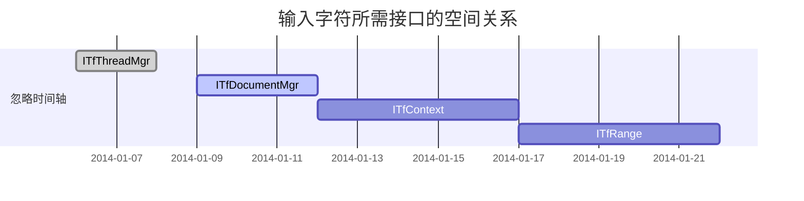
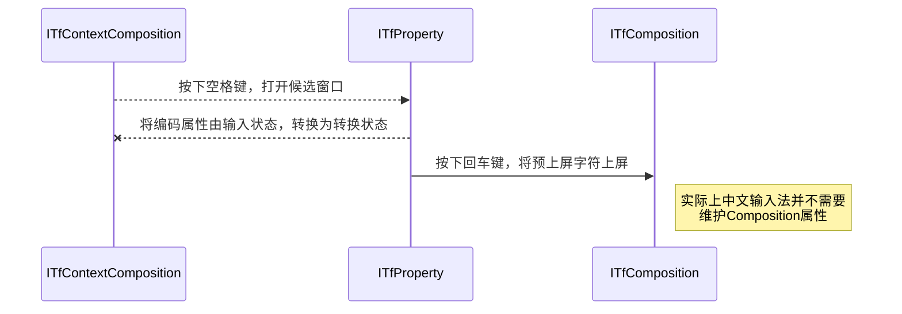
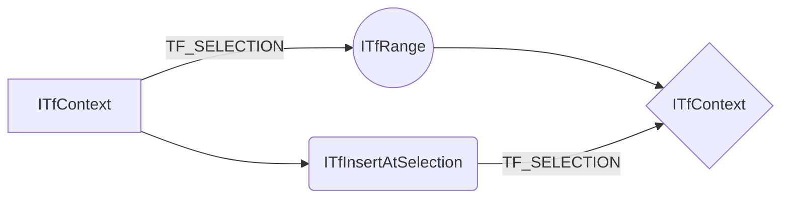

@[TOC](第1章 TSF简介)
# 1.0 本章资料
[Microsoft Windows Text Services Framework](https://learn.microsoft.com/zh-cn/windows/win32/tsf/text-services-framework?redirectedfrom=MSDN)
官方文档，比较难懂。

[逗比的输入法实现](https://yangyuan.github.io/post/2015-01-08-zh-meow-ime/)
这是我找到的最好的TSF输入法介绍。

[TSF输入法中文文档的主页](http://wowoboke.com/tsf/)
可以看看这个作为补充。

[fishmai的专栏](https://blog.csdn.net/fishmai/category_6752029.html)
比较乱，但是内容有价值。

## 1.1创建一个表格

项目     | Describe
-------- | -----
DLL  | TSF和IME输入法一样，都是DLL。IME是通过导出函数实现的输入法功能，而TSF输入法的功能是在COM接口中完成的。
COM  | TSF是一个COM组件。不但要实现相应的TSF框架接口，而且一些输入法功能，也是Windows通过相应接口提供的。
Text Service  | 客户程序和文本服务通过TSF管理器实现管理。客户程序与文本服务不直接发生交互。

### 1.2设定内容居中、居左、居右
在编译好的TSF输入法dll文件目录，以管理员身份启动CMD控制台，注册输入法。
```
regsvr32.exe XXX.dll
```
其实这就是COM组件的注册方法，注册TSF输入法具体分为以下步骤。
| 步骤       | 调用的系统接口         | 写入的注册表键        |
|:-----------:| -------------:|:-------------|
| 注册COM组件 | 注册表API函数  | HKEY_CLASSES_ROOT\CLSID\{CLSID}\ | 
| 注册Text Input Processor | ITfInputProcessorProfiles  | HKEY_LOCAL_MACHINE\SOFTWARE\Microsoft\CTF\TIP\{CLSID}\ | 
| 注册TSF类别 | IID_ITfCategoryMgr  | HKEY_LOCAL_MACHINE\SOFTWARE\Microsoft\CTF\TIP\{CLSID}\Category\ | 

## 1.3如何创建一个注脚

TSF输入法的调试比较繁琐。有两个原因，一是涉及到输入焦点，导致调试时反复因为焦点事件中断。二是，输入法会加载到系统里，导致调试时可能会跳到其他进程。
我在VMware虚拟机里调试输入法，主要还是不太会如何调试程序。这里可以下载操作系统。[^1]

[^1]: https://next.itellyou.cn/

## 1.4KaTeX数学公式

您可以使用渲染LaTeX数学表达式 [KaTeX](https://khan.github.io/KaTeX/):

《西游记》吃人参果一集，有个情节我记忆挺深刻，猪八戒一口就把人参果吞了，然后眼巴巴的看着孙悟空和沙僧细嚼慢咽。刚刚知道用文学表达，这叫“我们无法同时拥有青春和对青春的感受”。
曾经立志用10年研究出输入法来，后来延长到20年。再后来将这个期限增加到30年，再后来已经不再计数了。
第一次去知识产权局申请专利，碰见一个发明永动机的少年。手里拿了一张皱皱的草纸，画了一张比梗图还要暴漫的永动机。自述是花了二十天扒火车过来的，身上脏脏的。审查员告诉他申请文件必须是打印的，不受理手写的，让他去打字社。打字社的人说这是画，没法打，让他去找个代理。于是他就怔怔的站在那里。
可能他是他们村最聪明的少年了，至少他自认为自己要成为最聪明的少年。
开始，我只是以为，民科的知识支撑不起民科的理想。民科缺乏接触知识的环境。
我想，如果那个少年不想被人嘲笑，而努力学习的话，那么他大概率会成为一名优秀的农民工。

如果把人的欲望或需求从高到低排成一列，另一列按人的能力或地位从高到低排序。那么总是排在前面的人，先挑走优质的资源。
这种排序，分为上半区和下半区，或者说分为胜者组和败者组。每个人都要发挥自己的优势，从而获得更好的排位。所以上半区比拼的更多是个人的能力。
而下半区，则是在能力比拼中落败的败者组们，比拼的是能力之外的东西。所以一般表现为，上半区表现为竞争，而下半区表现为内卷。

对于社会底层而言，最好的选择是心甘情愿的做牛做马，教育的目的一向如此。因为社会总是要维持这种结构，你提高了排名，那意味着你把提高的这个区间中的N个人，都从他们原先的位置挤了下来。
所以你会发现，你上升的阻力往往来自和你同区间的人群。因为你对比你高阶层的人构不成威胁，同样比你低阶层的人也对你构不成威胁。
这种排名既不是快速排序，也不是冒泡算法。而是类似于升学考试这样的比赛。
当你出生在山区，你要在小学这样的资格赛中胜出，然后和出生在城市的种子队进行高考。与体育比赛不同，体育比赛决出冠亚军后，比赛就结束了。
而在社会中，这些淘汰的队伍依旧要决出排名，这不是复活赛，而是找出更傻的。

我一直想记录下此时此刻的心情，好在将来的某一天翻出来查看。我从上幼儿园的第一天，就开始罚站，只是因为我睡午睡时不闭眼。
我就不声不响的站在铁皮门后，铁皮门外是条大街，门上有钉子眼，可以透过钉子眼看到外面的世界。街上少有行人，大多时候只是空空荡荡的大街。
上小学的第一天，因为不肯站队，被建议退学。似乎我一直不擅长集体活动，当时从别人的角度看，我是一个很犟的人，是因为我从那个时候，就意识到我不想成为他们那样的人。
我处在社会底层，我看不到值得我学习的榜样，甚至看不到希望。我如果听话，只不过被教育成他们的样子而已。
如果有平行世界，在每一个平行世界里我应该都是很蠢的，下场可能都不会好。因为我一直不肯束手就范。

直到有一天，我突然得了数学竞赛的三等奖。在他们看来挺神奇的，好像这是一次挺重要的比赛，老师还帮重点培养对象改了答案。
可能这是我第一次改变命运的机会吧，我发现了我的特长，我会别人不会的东西。因此我有了参加科技夏令营的资格。我被分到了航模组，但是我想参加计算机组。
因为我看过一眼学习机，真的只是一眼，就看见个方块光标。我觉得这个很有意思。在夏令营的最后一天，机房的管理不严了，后门开了。
我终于看见了计算机的样子，绿色的屏幕上，有人在玩直升机游戏。然后大门又被关上了，从那一眼起，我知道了我要做什么。

我想那个发明永动机的少年，只不过想成为人生的玩家而不是NPC。那张皱巴巴的纸就是民科手中的木剑。他听说了永动机，而我看见了计算机。

如此而已。

> 你可以找到更多关于的信息 **LaTeX** 数学表达式[here][1].

## 1.5新的甘特图功能，丰富你的文章

本节为了学习甘特图，而用了甘特图的表示格式。请忽略时间轴，时间轴与本节内容无关。

文本服务在ITfTextInputProcessor::Activate()方法中获取线程管理器对象ITfThreadMgr。

文本服务通过调用ITfThreadMgr::GetFocus()来获取当前处于活动状态的文档管理器对象ITfDocumentMgr。

然后调用ITfDocumentMgr::GetTop()以获取堆栈顶部的编辑上下文ITfContext。

调用ITfContext::GetSelection()方法获得编辑范围对象ITfRange。

最后调用ITfRange::SetText()将字符发送给TSF管理器。

- 关于 **甘特图** 语法，参考 [这儿][2],

## 1.6UML 图表

当用户按下需要文本服务处理的按键时，文本服务创建ITfEditSession对象，并将这个对象作为参数调用ITfContext::RequestEditSession()方法。
TSF管理器会立即同步或异步调用ITfEditSession::DoEditSession()方法，在DoEditSession方法中完成一次按键处理。
按打字顺序，Composition生命周期如下：


首次按下编码按键，文本服务调用_pContext->QueryInterface(IID_ITfContextComposition, (void **)&pContextComposition);得到ITfContextComposition对象。
然后调用pContextComposition->StartComposition(ec, pRangeInsert, _pTextService, &pComposition);创建ITfComposition对象。

在Input状态，按下空格键，文本服务调用ITfProperty::SetValue();将输入的编码由Input状态转换为Converted状态。
并创建候选窗口。（与现行的中文输入法不同，在日文输入法、注音输入法或者早期的智能ABC、微软拼音中，都是按空格键后才打开候选窗口）

在Composition状态，按下回车键，文本服务调用_pComposition->EndComposition(ec);结束Composition。

有两种方法将字符写入到ITfContext中。



第一种方法：
首先，文本服务调用pContext->GetSelection()，得到TF_SELECTION结构。<br/>
然后，调用tfSelection.range->SetText()，将字符写入TF_SELECTION结构。<br/>
最后，调用pContext->SetSelection()，将TF_SELECTION写入上下文。

第二种方法：
首先，从上下文中pContext->QueryInterface(IID_ITfInsertAtSelection, (void **)&pInsertAtSelection)，得到ITfInsertAtSelection接口。<br/>
然后，调用pInsertAtSelection->InsertTextAtSelection(ec, 0, pchText, cchText, &pRange)，将字符写入到范围（片段）ITfRange中。<br/>
接着，设置TF_SELECTION结构。<br/>
最后，调用pContext->SetSelection()，将TF_SELECTION写入上下文。<br/>

- 关于 **Mermaid** 语法，参考 [这儿][3],

## 1.7导出与导入

### 1.7.1导出
下一章开始介绍一个微软早期的TSF样例。

### 1.7.2导入
继续学习COM，这东西好复杂。

 [1]: http://meta.math.stackexchange.com/questions/5020/mathjax-basic-tutorial-and-quick-reference
 [2]: https://mermaidjs.github.io/
 [3]: https://mermaidjs.github.io/