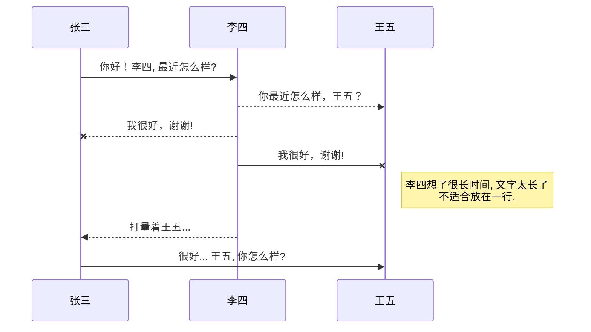
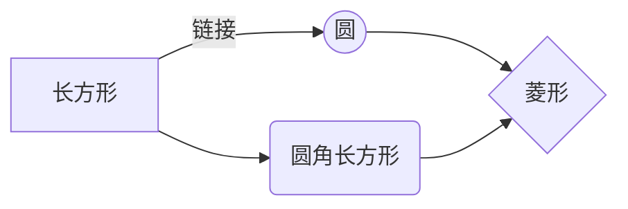

@[TOC](第1章 TSF简介)
# 1.0 本章资料
[Microsoft Windows Text Services Framework](https://learn.microsoft.com/zh-cn/windows/win32/tsf/text-services-framework?redirectedfrom=MSDN)
官方文档，比较难懂。

[逗比的输入法实现](https://yangyuan.github.io/post/2015-01-08-zh-meow-ime/)
这是我找到的最好的TSF输入法介绍。

[TSF输入法中文文档的主页](http://wowoboke.com/tsf/)
可以看看这个作为补充。

[fishmai的专栏](https://blog.csdn.net/fishmai/category_6752029.html)
比较乱，但是内容非常有价值。

## 1.1创建一个表格

项目     | Describe
-------- | -----
DLL  | TSF和IME输入法一样，都是DLL。IME是通过导出函数实现的输入法功能，而TSF输入法的功能是在COM接口中完成的。
COM  | TSF是一个COM组件。不但要实现相应的TSF框架接口，而且一些输入法功能，也是Windows通过相应接口提供的。
Text Service  | 客户程序和文本服务通过TSF管理器实现管理。客户程序与文本服务不直接发生交互。

### 1.2设定内容居中、居左、居右
在编译好的TSF输入法dll文件目录，以管理员身份启动CMD控制台，注册输入法。
```
regsvr32.exe XXX.dll
```
其实这就是COM组件的注册方法，具体分为以下步骤。
| 步骤       | 调用的系统接口         | 写入的注册表键        |
|:-----------:| -------------:|:-------------|
| 注册COM组件 | 注册表API函数  | HKEY_CLASSES_ROOT\CLSID\{CLSID}\ | 
| 注册Text Input Processor | ITfInputProcessorProfiles  | HKEY_LOCAL_MACHINE\SOFTWARE\Microsoft\CTF\TIP\{CLSID}\ | 
| 注册TSF类别 | IID_ITfCategoryMgr  | HKEY_LOCAL_MACHINE\SOFTWARE\Microsoft\CTF\TIP\{CLSID}\Category\ | 

## 1.3如何创建一个注脚

TSF输入法的调试比较繁琐。有两个原因，一是涉及到输入焦点，导致调试时反复因为焦点事件中断。二是，输入法会加载到系统里，导致调试时可能跳到其他进程里。
我一般在VMware虚拟机里调试输入法，这样就不怕我把系统折腾坏了。这里可以下载操作系统[^1]

[^1]: https://next.itellyou.cn/

## 1.4KaTeX数学公式

您可以使用渲染LaTeX数学表达式 [KaTeX](https://khan.github.io/KaTeX/):

《西游记》吃人参果一集有个情节我记忆挺深刻，那就是猪八戒一口就把人参果吞了，然后眼巴巴的看着孙悟空和沙僧细嚼慢咽。刚刚知道用文学表达，这叫“我们无法同时拥有青春和对青春的感受”。
曾经立志用10年研究出输入法来，后来延长到20年。再后来将这个期限增加到30年，再后来已经不再计数了。
第一次去知识产权局申请专利，碰见一个发明永动机的少年。手里拿了一张皱皱的草纸，画了一张比现在梗图还要暴漫的永动机。自述是一路扒火车过来的，身上脏脏的。办事员告诉他申请文件必须是打印的，不受理手写的，让他去打字社。打字社的人说这是画，没法打，让他去找个代理。于是他就怔怔的站在那里。
我想，可能他是他们村最聪明的少年了，至少他自认为自己要成为最聪明的少年。
开始，我只是以为，民科的知识支撑不起民科的理想。民科只是缺乏一个知识的环境。

> 你可以找到更多关于的信息 **LaTeX** 数学表达式[here][1].

## 1.5新的甘特图功能，丰富你的文章

```mermaid
gantt
        dateFormat  YYYY-MM-DD
        title Adding GANTT diagram functionality to mermaid
        section 现有任务
        已完成               :done,    des1, abc,def
        进行中               :active,  des2, 2014-01-09, 3d
        计划一               :         des3, after des2, 5d
        计划二               :         des4, after des3, 5d
```
- 关于 **甘特图** 语法，参考 [这儿][2],

## UML 图表

可以使用UML图表进行渲染。 [Mermaid](https://mermaidjs.github.io/). 例如下面产生的一个序列图：



这将产生一个流程图。:



- 关于 **Mermaid** 语法，参考 [这儿][3],

## FLowchart流程图

我们依旧会支持flowchart的流程图：
```mermaid
flowchat
st=>start: 开始
e=>end: 结束
op=>operation: 我的操作
cond=>condition: 确认？

st->op->cond
cond(yes)->e
cond(no)->op
```

- 关于 **Flowchart流程图** 语法，参考 [这儿][4].

## 导出与导入

###  导出
如果你想尝试使用此编辑器, 你可以在此篇文章任意编辑。当你完成了一篇文章的写作, 在上方工具栏找到 **文章导出** ，生成一个.md文件或者.html文件进行本地保存。

### 导入
如果你想加载一篇你写过的.md文件，在上方工具栏可以选择导入功能进行对应扩展名的文件导入，
继续你的创作。

 [1]: http://meta.math.stackexchange.com/questions/5020/mathjax-basic-tutorial-and-quick-reference
 [2]: https://mermaidjs.github.io/
 [3]: https://mermaidjs.github.io/
 [4]: http://adrai.github.io/flowchart.js/